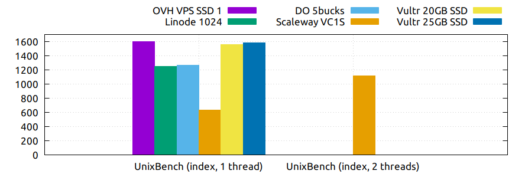
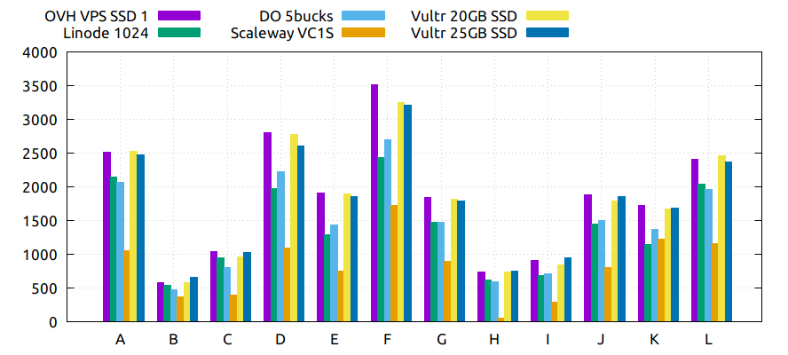
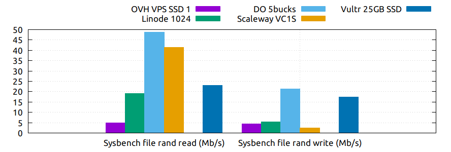
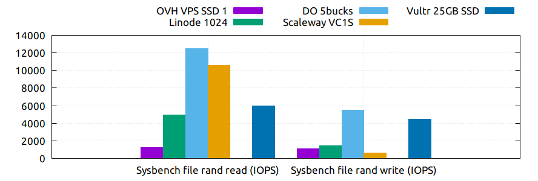
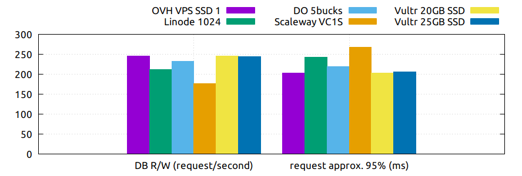
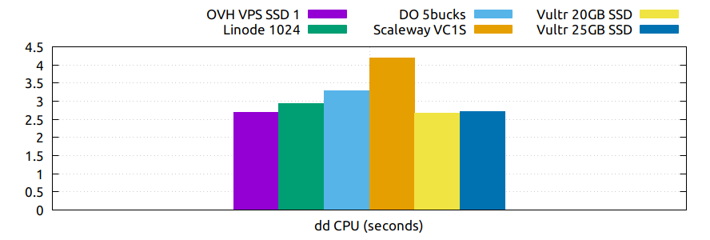
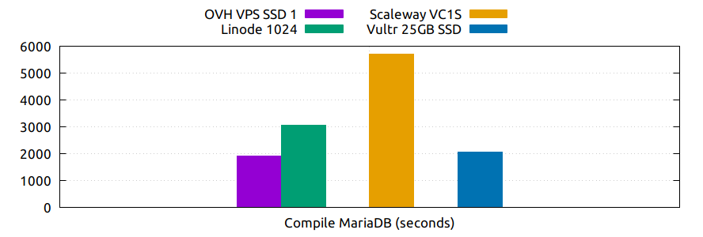
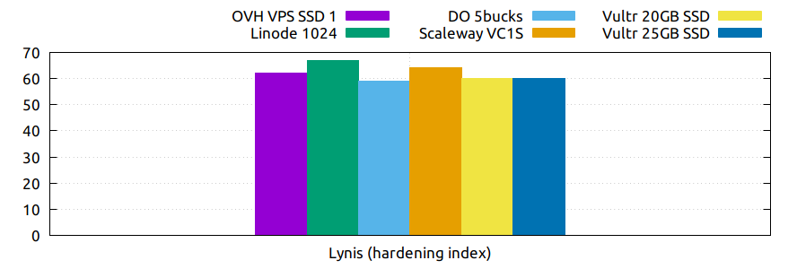

**WARNING: A work in progress!**

VPS Comparison
==============

A comparison between some VPS providers that have data centers located in **Europe**.

Initially I'm comparing only entry plans, below **5$** monthly.

What I trying to show here it's basically a lot of things that I would want to know before sign up with any of them. If I save you a few hours researching, like I spend, I'll be glad!

VPS Providers
=============

Company
-------

|              | OVH                           | Linode                            | DigitalOcean                                 | Scaleway                              | Vultr                           |
|--------------|-------------------------------|-----------------------------------|----------------------------------------------|---------------------------------------|---------------------------------|
| Foundation   | 1999                          | 2003                              | 2011                                         | 2013                                  | 2014                            |
| Headquarters | Roubaix (FR)                  | Galloway, NJ (US)                 | New York (US)                                | Paris (FR)                            | Matawan, NJ (US)                |
| Market       | 3° largest                    |                                   | 2° largest                                   |                                       |                                 |
| Website      | [OVH](https://www.ovh.com/us) | [Linode](https://www.linode.com/) | [DigitalOcean](https://www.digitalocean.com) | [Scaleway](https://www.scaleway.com/) | [Vultr](https://www.vultr.com/) |

Notes:

-   The companies are sorted by the year of foundation.
-   Scaleway is a cloud division of Online.net (1999), itself subsidiary of the Iliad group (1990) owner also of the famous French ISP Free.
-   Vultr Holdings LLC is owned by Choopa LLC founded in 2010.
-   The Market numbers are extracted from the Wikipedia an other sources

Billing
-------

|                    | OVH | Linode | DigitalOcean | Scaleway | Vultr |
|--------------------|-----|--------|--------------|----------|-------|
| Credit Card        | Yes | Yes    | Yes          | Yes      | Yes   |
| PayPal             | Yes | Yes    | Yes          | No       | Yes   |
| Bitcoin            | No  | No     | No           | No       | Yes   |
| Affiliate/Referral | Yes | Yes    | Yes          | No       | Yes   |
| Coupon Codes       | Yes | Yes    | Yes          | Yes      | Yes   |

Note:

-   Linode needs a credit card associated with the account first to be able to pay with PayPal later.

General Features
----------------

|                            | OVH                                                   | Linode                                 | DigitalOcean                                                   | Scaleway                                                                                       | Vultr                                   |
|----------------------------|-------------------------------------------------------|----------------------------------------|----------------------------------------------------------------|------------------------------------------------------------------------------------------------|-----------------------------------------|
| European data centers      | 3                                                     | 2                                      | 3                                                              | 2                                                                                              | 4                                       |
| Documentation              | [Docs](https://www.ovh.co.uk/community/knowledge/)    | [Docs](https://www.linode.com/docs/)   | [Docs](https://www.digitalocean.com/community)                 | [Docs](https://www.scaleway.com/docs/)                                                         | [Docs](https://www.vultr.com/docs/)     |
| Doc. subjetive valuation   | 6/10                                                  | 9/10                                   | 9/10                                                           | 6/10                                                                                           | 8/10                                    |
| Uptime guaranteed (SLA)    | 99,95%                                                | 99,9%                                  | 99,99%                                                         | 99,9%                                                                                          | 100%                                    |
| Outage refund/credit (SLA) | Yes                                                   | Yes                                    | Yes                                                            | No                                                                                             | Yes                                     |
| API                        | Yes                                                   | Yes                                    | Yes                                                            | Yes                                                                                            | Yes                                     |
| API Docs                   | [API Docs](https://api.ovh.com/)                      | [API Docs](https://www.linode.com/api) | [API Docs](https://developers.digitalocean.com/documentation/) | [API Docs](https://developer.scaleway.com/)                                                    | [API Docs](https://www.vultr.com/api/)  |
| Services status page       | [Status](http://status.ovh.com/)                      | [Status](https://status.linode.com/)   | [Status](https://status.digitalocean.com/)                     | [Status](https://status.online.net/tasklist/?project=11&status=&perpage=50&order=id&sort=desc) | [Status](https://www.vultr.com/status/) |
| Support Quality            |                                                       |                                        |                                                                |                                                                                                |                                         |
| Account Limits             |                                                       |                                        | 10 instances                                                   | Limited instances (e.g. 50 VC1S )                                                              | 10 instances                            |
| Legal/ToS                  | [ToS](https://www.ovh.com/us/support/termsofservice/) | [ToS](https://www.linode.com/tos)      | [ToS](https://www.digitalocean.com/legal/terms/)               | [ToS](https://www.scaleway.com/terms/)                                                         | [ToS](https://www.vultr.com/legal/tos/) |

Note:

-   Scaleway has four grades of SLA, the first basic is for free but if you want something better, you have to pay a monthly fee.
-   One of the reasons why the Linode's documentation is so good and detailed is that they [pay you 250$](https://www.linode.com/docs/linode-writers-guide/) for write a guide for them if it's good enough to publish. They are a small team (about 70 people), so it makes sense.
-   The Linode API is not a RESTful API yet, but they are working in an upcoming one.
-   The default limits usually can be increased by asking support. Those limits are set by default by the providers to stop abusing the accounts.
-   Scaleway also imposes a lot more of limits that can be looked up in the account settings (e.g. 100 images or 25 snapshots).
-   Vultr also impose a limit of a maximum instance cost of 150$ per month and requires a deposit when charges exceed 50$.

### European data centers

-   **OVH**: Gravelines (FR), Roubaix (FR), Strasboug (DE). It has also a data center in Paris (FR), but is not available for these plans.
-   **Linode**: Frankfurt (DE), London (GB)
-   **DigitalOcean**: Amsterdam (NL), Frankfurt (DE), London (GB)
-   **Scaleway**: Amsterdam (NL), Paris (FR)
-   **Vultr**: Amsterdam (NL), Frankfurt (DE), London (GB), Paris (FR)

Control Panel
=============

Features
--------

|                                     | OVH               | Linode                | DigitalOcean                                 | Scaleway     | Vultr                                |
|-------------------------------------|-------------------|-----------------------|----------------------------------------------|--------------|--------------------------------------|
| Subjective control panel evaluation | 5/10              | 6/10                  | 8/10                                         | 5/10         | 9/10                                 |
| Graphs                              | Traffic, CPU, RAM | CPU, Traffic, Disk IO | CPU, RAM, Disk IO, Disk usage, Bandwith, Top | No           | Monthly Bandwith, CPU, Disk, Network |
| Subjective graphs valuation         | 5/10              | 8/10                  | 9/10                                         | 0/10         | 8/10                                 |
| Monthly usage per instance          | No                | Yes                   | No                                           | No           | Bandwith, Credits                    |
| KVM Console                         | Yes               | Yes (Glish)           | Yes (VNC)                                    | Yes          | Yes                                  |
| Power management                    | Yes               | Yes                   | Yes                                          | Yes          | Yes                                  |
| Reset root password                 | Yes               | Yes                   | Yes                                          | No           | No                                   |
| Reinstall instance                  | Yes               | Yes                   | Yes                                          | No           | Yes                                  |
| First provision time                | Several hours     | &lt;1 min             | &lt;1 min                                    | some minutes | some minutes                         |
| Median reinstall time               | ~12,5 min         | ~50 s                 | ~35 s                                        | N/A          | ~2,1 min                             |
| Upgrade instance                    | Yes               | Yes                   | Yes                                          | No           | Yes                                  |
| Change Linux Kernel                 | No                | Yes                   | CentOS                                       | Yes          | No                                   |
| Recovery mode                       | No                | Yes                   | Yes                                          | Yes          | Boot with custom ISO                 |
| Tag instances                       | No                | Yes                   | Yes                                          | Yes          | Yes                                  |
| Responsive design (mobile UI)       | No                | No                    | No                                           | No           | Yes                                  |
| Android App                         | Only in France    | Yes                   | Unofficial                                   | No           | Yes                                  |
| iOS App                             | Yes               | Yes                   | Unofficial                                   | No           | Unofficial                           |

Notes:

-   The OVH panel has a very old interface, effective but antique and cumbersome.
-   Linode also has an old interface, too much powerful, but not friendly. But in the coming months they are going to deliver a new control panel in Beta.
-   Linode let you choose the Linux Kernel version in the profile of your instance.
-   To reset the root password from the control panel is not a good security measure IMHO, it's useful, but you already have the KVM console for that.
-   In Vultr you can copy/see the masked default root password, but not reset it. This is necessary because the password is never sent by email.
-   You can resintall the instances using the same SO/App or choosing another one.
-   Linode reinstall time (they call it rebuild) does not include the boot time, the instance is not started automatically.
-   In Vultr can use a custom ISO or choose one from the library like SystemRescueCD or Trinity Rescue Kit to boot your instance and perform recovery tasks.
-   Linode has an additional console (Lish) that allows you to control your instance even when is inaccessible by ssh and perform rescue or management tasks.
-   In Scaleway you have to set a root password first to get access to the KVM console.
-   The Scaleway's control panel in the basic account/SLA level is very limited and counter-intuitive, I don't know if this improves with superior levels.
-   In Scaleway happened to me once that the provision time exceed more than 45 min that I have to cancel the operation (that it was not easy, though).
-   In OVH the first provision of a VPS server it's a manual process and you have to pass a weird identification protocol on the way, including an incoming phone call in my case.

Instance creation
-----------------

### Operating Systems

|          | OVH                                | Linode                                                            | DigitalOcean                   | Scaleway                               | Vultr                          |
|----------|------------------------------------|-------------------------------------------------------------------|--------------------------------|----------------------------------------|--------------------------------|
| Linux    | Arch Linux, CentOS, Debian, Ubuntu | Arch, CentOS, Debian, Fedora, Gentoo, OpenSUSE, Slackware, Ubuntu | CentOS, Debian, Fedora, Ubuntu | Alpine, CentOS, Debian, Gentoo, Ubuntu | CentOS, Debian, Fedora, Ubuntu |
| BSD      | No                                 | No                                                                | FreeBSD                        | No                                     | FreeBSD, OpenBSD               |
| Windows  | No                                 | No                                                                | No                             | No                                     | Windows 2012 R2 (16$)          |
| Other SO | No                                 | No                                                                | CoreOS                         | No                                     | CoreOS                         |

Note:

-   OVH also offers Linux two desktop distributions: Kubuntu and OVH Release 3.

### One-click Apps

|                | OVH           | Linode | DigitalOcean          | Scaleway       | Vultr                |
|----------------|---------------|--------|-----------------------|----------------|----------------------|
| Docker         | Yes           | No     | Yes                   | Yes            | Yes                  |
| Stacks         | LAMP          | No     | LAMP, LEMP, ELK, MEAN | LEMP, ELK      | LAMP, LEMP           |
| Drupal         | Yes           | No     | Yes                   | Yes            | Yes                  |
| WordPress      | Yes           | No     | Yes                   | No             | Yes                  |
| Joomla         | Yes           | No     | No                    | No             | Yes                  |
| Django         | No            | No     | Yes                   | No             | No                   |
| RoR            | No            | No     | Yes                   | No             | No                   |
| GitLab         | No            | No     | Yes                   | Yes            | Yes                  |
| Node.js        | No            | No     | Yes                   | Yes            | No                   |
| E-Commerce     | PrestaShop    | No     | Magento               | PrestaShop     | Magento, PrestaShop  |
| Personal cloud | Coyz          | No     | NextCloud, ownCloud   | OwnCloud, Cozy | NextCloud, ownCloud  |
| Panels         | Plesk, cPanel | No     | No                    | Webmin         | cPanel (15$), Webmin |

Notes:

-   Some providers offer more one-click Apps that I do not include here to save space.
-   Some of this apps in some providers require a bigger and more expensive plan that the entry ones below 5$ that I analyze here.
-   Linode does not offers you any one-click app. Linode is old-school, you can do it yourself, and also Linode gives you plenty of detailed documentation to do it that way.
-   OVH uses Ubuntu, Debian or CentOS as SO for its apps.
-   Digital Ocean uses Ubuntu as SO for all of its apps.
-   Vultr uses CentOS as SO for all of its apps.
-   OVH Also offers Dokku on Ubuntu.
-   Do you really need a Panel (like cPanel)? They usually are a considerable security risk with several vulnerabilities and admin rights.

### Other features

|                    | OVH | Linode       | DigitalOcean | Scaleway | Vultr |
|--------------------|-----|--------------|--------------|----------|-------|
| ISO images library | No  | No           | No           | No       | Yes   |
| Custom ISO image   | No  | Yes          | No           | Yes      | Yes   |
| Install scripts    | No  | StackScripts | Cloud-init   | No       | iPXE  |
| Preloaded SSH keys | Yes | No           | Yes          | Yes      | Yes   |

Notes:

-   Linode lets you install virtually any SO in your instance in the old-school way, almost as if you'd have to deal with the bare metal. Even the instance does not boot itself at the end, you have to boot it yourself from the control panel.
-   The Vultr's ISO image library include several ISOs like Alpine, Arch, Finnix, FreePBX, pfSense, Rancher Os, SystemRescueCD, and Trinity Rescue Kit.
-   The Vultr's "Custom ISO image" feature allows you to install virtually any SO supported by KVM and the server architecture.
-   Linode does not preload your ssh keys into the instance automatically, but it's trivial to do it manually anyway (ssh-copy-id).
-   Scaleway has a curious way to provide custom images, a service called [Image Builder.](https://github.com/scaleway/image-builder) You have to create an instance with the Image Builder an from there you are able to create you own ISO image usign a Docker builder system that create images that can run on real hardware.

Security
--------

|                             | OVH                                                              | Linode                                                                                          | DigitalOcean                                                                                             | Scaleway                                                               | Vultr                                                                                   |
|-----------------------------|------------------------------------------------------------------|-------------------------------------------------------------------------------------------------|----------------------------------------------------------------------------------------------------------|------------------------------------------------------------------------|-----------------------------------------------------------------------------------------|
| 2FA                         | Yes                                                              | Yes                                                                                             | Yes                                                                                                      | No                                                                     | Yes                                                                                     |
| Restrict access IPs         | Yes                                                              | Yes                                                                                             | No                                                                                                       | No                                                                     | No                                                                                      |
| Account Login Logs          | No                                                               | Partial                                                                                         | Yes                                                                                                      | No                                                                     | No                                                                                      |
| SSL Quality                 | [A-](https://www.ssllabs.com/ssltest/analyze.html?d=www.ovh.com) | [A+](https://www.ssllabs.com/ssltest/analyze.html?d=manager.linode.com&s=69.164.200.204&latest) | [A+](https://www.ssllabs.com/ssltest/analyze.html?d=cloud.digitalocean.com&s=104.16.25.4&hideResults=on) | [A](https://www.ssllabs.com/ssltest/analyze.html?d=cloud.scaleway.com) | [A](https://www.ssllabs.com/ssltest/analyze.html?d=my.vultr.com&s=104.20.22.240&latest) |
| Send root password by email | Yes                                                              | No                                                                                              | No                                                                                                       | No                                                                     | No                                                                                      |
| Account password recovery   | Link                                                             | Link                                                                                            | Link                                                                                                     | Link                                                                   | Link                                                                                    |

Notes:

-   Send plain text passwords by email is a very bad practice in terms of security.
-   OVH sends you the root password optionally if you use SSH keys, always in plain text if not.
-   Linode never sends you the root password because you are the one that sets it (even boot the instance for first time).
-   DigitalOcean sends you the passwords only if you don't use SSH keys, in plain text.
-   Vultr never sends you the root password, only the needed ones for one-click apps.
-   Linode only register the last login time for each user, and does not register the IP.
-   The account password recovery should be always through a reset link by email, and never get you current password back (and in plain text), but you never know... and if you find a provider doing that, you don't need to know anymore, get out of there as soon as possible and never reuse that password (any password).

Plans (≤5$)
===========

Features
--------

|                      | OVH              | Linode                 | DigitalOcean                           | Scaleway           | Vultr                                  | Vultr                                  |
|----------------------|------------------|------------------------|----------------------------------------|--------------------|----------------------------------------|----------------------------------------|
| Name                 | VPS SSD 1        | Linode 1024            | 5bucks                                 | VC1S               | 20GB SSD                               | 25GB SSD                               |
| Monthly Price        | 3,62€            | 5$                     | 5$                                     | 2,99€              | 2,5$                                   | 5$                                     |
| CPU / Threads        | 1/1              | 1/1                    | 1/1                                    | 1/2                | 1/1                                    | 1/1                                    |
| CPU model            | Xeon E5v3 2.4GHz | Xeon E5-2680 v3 2.5GHz | Xeon E5-2650L v3 1.80 GHz              | Atom C2750 2.4 GHz | Intel Xeon 2.4 GHz                     | Intel Xeon 2.4 GHz                     |
| RAM                  | 2 GB             | 1 GB                   | 512 MB                                 | 2 GB               | 512 MB                                 | 1 GB                                   |
| SSD Storage          | 10 GB            | 20 GB                  | 20 GB                                  | 50 GB              | 20 GB                                  | 25 GB                                  |
| Traffic              | ∞                | 1 TB                   | 1 TB                                   | ∞                  | 500 GB                                 | 1 TB                                   |
| Bandwidth (In / Out) | 100/100 Mbps     | 40/1 Gbps              | 1/10 Gbps                              | 200/200 Mbps       | 1/10 Gbps                              | 1/10 Gbps                              |
| Virtualization       | KVM              | KVM (Qemu)             | KVM                                    | KVM (Qemu)         | KVM (Qemu)                             | KVM (Qemu)                             |
| Anti-DDoS Protection | Yes              | No                     | No                                     | No                 | 10$                                    | 10$                                    |
| Backups              | No               | 2$                     | 1$                                     | No                 | 0,5 $                                  | 1$                                     |
| Snapshots            | 2,99$            | Free (up to 3)         | 0,05$ per GB                           | 0,02 € per GB      | Free (Beta)                            | Free (Beta)                            |
| IPv6                 | Yes              | Yes                    | Optional                               | Optional           | Optional                               | Optional                               |
| Additional public IP | 2$ (up to 16)    | Yes                    | Floating IPs (0,006$ hour if inactive) | 0,9€ (up to 10)    | 2$ (up to 2) / 3$ floating IPs         | 2$ (up to 2) / 3$ floating IPs         |
| Private Network      | No               | Optional               | Optional                               | No (dynamic IPs)   | Optional                               | Optional                               |
| Group firewall       | No               | No                     | No                                     | Yes                | Yes                                    | Yes                                    |
| Block Storage        | From 5€ - 50GB   | No                     | From 10$ - 100GB                       | From 1€ - 50GB     | From 1$ - 10GB                         | From 1$ - 10GB                         |
| Monitoring           | Yes (SLA)        | Yes (metrics, SLA)     | Beta (metrics, performance, SLA)       | No                 | No                                     | No                                     |
| Load Balancer        | 13$              | 20$                    | 20$                                    | No                 | High availability (floating IPs & BGP) | High availability (floating IPs & BGP) |
| DNS Zone             | Yes              | Yes                    | Yes                                    | No                 | Yes                                    | Yes                                    |
| Reverse DNS          | Yes              | Yes                    | Yes                                    | Yes                | Yes                                    | Yes                                    |

Note:

-   OVH hides its real CPU, but what they claim in their web matches with the hardware information reported in the tests (an E5-2620 v3 or E5-2630 v3).
-   Vultr also hides the real CPU, but it could be a Xeon E5-2620/2630 v3 for the 20GB SSD plan and probably a v4 for the 25GB SSD one.
-   The prices for DigitalOcean and Vultr do not include taxes (VAT) for European countries.
-   I have serious doubts about the OVH's and Scaleway's unlimited traffic, seems more marketing strategy than real to me (joe di castro).
-   Linode allows you to have free additional public IPs but you have to request them to support and justify that you need them.
-   Linode Longview's monitoring system is free up to 10 clients, but also has a professional version that starts at 20$/mo for three client.
-   Linode don't support currently block storage, but they are working on it to offer the service in the upcoming months.
-   Linode snapshots (called Images) are limited to 2GB per Image, with a total of 10GB total Image storage and 3 Images per account. Disks of recently rebuilt instances are automatically stored as Images.
-   Scaleway also offers for the same price a BareMetal plan (with 4 ARM Cores), but as it is a dedicated server, I do not include it here.
-   Scaleway does not offers Anti-DDoS protection but they maintain that they use the Online.net's standard one.
-   Scaleway uses dynamic IPs by default as private IPs and you only can opt to use static IPs if you **remove** the Public IP from the instance.

Tests
=====

All the numbers showed here can be founded in the `/logs` folder in this repository, keep in mind that usually I show averages of several iterations of the same test.

The graphs are generated with gnuplot directly from the tables of the `README.org` org-mode file.

TODO:

The next steps are going to add a few more tests and also to create two local scripts: one to collect the data from the logs automatically and get the averages in a csv table format, and other to clean the IPs from the logs. In this way would be more easy to create new tables and graphs with the data already available.

### WARNING

Performance tests can be affected by locations, data centers and VPS host neighbors. This is inherent to the same nature of the VPS service and can vary very significantly between instances of the same plan. For example, in the tests performed to realize this comparison I had found that in a plan (not included here, becasuse is more than $5/mo) a new instance that usually would give a UnixBench index about ~1700 only achieved an UnixBench index of 629,8. That's a considerable amount of lost performance in a VPS server... by the same price! Also the performance can vary over time, due to the VPS host neighbors. Because of this I discarded any instance that would report a poor performance and only show "typical" values for a given plan.

Automation
----------

I have chosen Ansible to automate the tests to recollect information from the VPS servers because once that the roles are write down it's pretty easy to anyone to replicate them and get its own results with a little effort.

The first thing that you have to do is to edit the `/ansible/hosts` file to use your own servers. In the template provided there are not real IPs present, but serves you as a guide of how to manage them. For example in this server:

    [digitalocean]
    do-5bucks-ubuntu          ansible_host=X.X.X.X   ansible_python_interpreter=/usr/bin/python3 

You should have to put your own server IP. The interpreter path is only needed when there is not a Python 2 interpreter available (like in Ubuntu). Also I'm using the variables per group to declare the default user of a server, and I'm grouping servers by provider. So, a complete example for a new provider using a new instance running Ubuntu should be like this:

    [new_provider]
    new_provider-plan_name-ubuntu   ansible_host=X.X.X.X   ansible_python_interpreter=/usr/bin/python3 

    [new_provider:vars] 
    ansible_user=root

And you can add as many servers/providers as you want. If you are already familiar with Ansible, you can suit the inventory file (`/ansible/hosts`) as you need.

The, you can start to tests the servers/providers using Ansible by running the playbook, but should be a good idea to test the acces first with a ping (from the `/ansible` folder):

``` bash
$ ansible all -m ping
```

If it's the first time that you are SSHing to a server, you are probably going to be asked to add it to the `\~/.ssh/known_hosts` file.

Then you can easily execute all the tasks in a server by:

``` bash
$ ansible-playbook site.yml -f 6
```

With the `-f 6` option you can specify how many forks you want to create to execute the tasks in parallel, the default is 5 but as I use here 6 VPS plans I use also 6 forks.

You can also run only selected tasks/roles by using tags. You can list all the available tasks:

``` bash
$ ansible-playbook site.yml --list-tasks
```

And run only the tags that you want:

``` bash
$ ansible-playbook site.yml -t benchmark
```

All the roles are set to store the logs of the tests in the `/logs/` folder using the `/logs/server_name` folder structure.

System Performance
------------------

All the instances were allocated in London (GB), except for OVH VPS SSD 1 in Gravelines (FR) and Scaleway VC1S in Paris (FR).

All the instances were running on Ubuntu 16.04 LTS

### UnixBench

[UnixBench](https://github.com/kdlucas/byte-unixbench) as is described in its page:

The purpose of UnixBench is to provide a basic indicator of the performance of a Unix-like system; hence, multiple tests are used to test various aspects of the system's performance. These test results are then compared to the scores from a baseline system to produce an index value, which is generally easier to handle than the raw scores. The entire set of index values is then combined to make an overall index for the system.

Keep in mind, that this index is very influenced by the CPU raw power, and does not reflect very well another aspects like disk performance and does test nothing about network. In this index, more is better.

I only execute this test once because it takes some time -about 30-45 minutes depending of the server- and the variations between several runs are almost never significant.

| Plan                         | OVH VPS SSD 1 | Linode 1024 | DO 5bucks | Scaleway VC1S | Vultr 20GB SSD | Vultr 25GB SSD |
|------------------------------|---------------|-------------|-----------|---------------|----------------|----------------|
| UnixBench (index, 1 thread)  | 1598,1        | 1248,6      | 1264,6    | 629,8         | 1555,1         | 1579.9         |
| UnixBench (index, 2 threads) |               |             |           | 1115,1        |                |                |



1.  Individual test indexes of the UnixBench benchmark.

    | Plan                                  |     | OVH VPS SSD 1 | Linode 1024 | DO 5bucks | Scaleway VC1S | Vultr 20GB SSD | Vultr 25GB SSD |
    |---------------------------------------|-----|---------------|-------------|-----------|---------------|----------------|----------------|
    | Dhrystone 2 using register variables  | A   | 2510.2        | 2150.0      | 2061.0    | 2100.1        | 2530.5         | 2474.5         |
    | Double-Precision Whetstone            | B   | 583.6         | 539.7       | 474.6     | 732.8         | 578.2          | 656.9          |
    | Execl Throughput                      | C   | 1038.9        | 941.8       | 799.5     | 736.0         | 963.8          | 1027.8         |
    | File Copy 1024 bufsize 2000 maxblocks | D   | 2799.5        | 1972.7      | 2222.5    | 1186.5        | 2775.3         | 2608.8         |
    | File Copy 256 bufsize 500 maxblocks   | E   | 1908.7        | 1286.2      | 1440.1    | 809.9         | 1888.8         | 1851.4         |
    | File Copy 4096 bufsize 8000 maxblocks | F   | 3507.1        | 2435.6      | 2692.6    | 2228.1        | 3248.4         | 3212.1         |
    | Pipe Throughput                       | G   | 1846.5        | 1472.1      | 1468.7    | 1785.3        | 1813.6         | 1789.6         |
    | Pipe-based Context Switching          | H   | 744.0         | 623.2       | 597.2     | 432.6         | 739.0          | 746.3          |
    | Process Creation                      | I   | 904.5         | 690.5       | 706.8     | 691.8         | 848.1          | 949.9          |
    | Shell Scripts (1 concurrent)          | J   | 1883.2        | 1442.0      | 1501.9    | 1268.6        | 1787.8         | 1851.2         |
    | Shell Scripts (8 concurrent)          | K   | 1725.0        | 1144.4      | 1362.7    | 1264.8        | 1665.9         | 1679.1         |
    | System Call Overhead                  | L   | 2410.1        | 2034.4      | 1955.6    | 1777.9        | 2461.0         | 2366.4         |

    

    Notes:

    -   Scaleway VC1S is the only plan that offers two CPU threads, so I show in the table the index for one and two threads but in the graph I only show the single thread one for a more fair comparison.

### Sysbench

Notes:

-   The Vultr 20GB SSD plan is currently temporarily unavailable and I cant' run the test with the last configuration, and therefore the average come from three iterations of the tests instead of five.
-   I'm only using one thread here for Scaleway's plan, to a more fair comparison.

1.  Sysbench cpu

    | Plan                   | OVH VPS SSD 1 | Linode 1024 | DO 5bucks | Scaleway VC1S | Vultr 20GB SSD | Vultr 25GB SSD |
    |------------------------|---------------|-------------|-----------|---------------|----------------|----------------|
    | Sysbench CPU (seconds) | 31,922        | 37,502      | 39,080    | 46,130        | 30,222         | 30,544         |

    

2.  Sysbench fileio

    | Plan                            | OVH VPS SSD 1 | Linode 1024 | DO 5bucks | Scaleway VC1S | Vultr 20GB SSD | Vultr 25GB SSD |
    |---------------------------------|---------------|-------------|-----------|---------------|----------------|----------------|
    | Sysbench file rand read (Mb/s)  | 4,813         | 19,240      | 48,807    | 41,353        |                | 23,022         |
    | Sysbench file rand write (Mb/s) | 4,315         | 5,529       | 21,400    | 2,482         |                | 17,510         |

    

    | Plan                            | OVH VPS SSD 1 | Linode 1024 | DO 5bucks | Scaleway VC1S | Vultr 20GB SSD | Vultr 25GB SSD |
    |---------------------------------|---------------|-------------|-----------|---------------|----------------|----------------|
    | Sysbench file rand read (IOPS)  | 1232          | 4925        | 12495     | 10586         |                | 5984           |
    | Sysbench file rand write (IOPS) | 1105          | 1415        | 5478      | 635           |                | 4482           |

    

3.  Sysbench oltp (database)

    I used the MySQL database for this tests, but the results could be applied also to the MariaDB database.

    | Plan                     | OVH VPS SSD 1 | Linode 1024 | DO 5bucks | Scaleway VC1S | Vultr 20GB SSD | Vultr 25GB SSD |
    |--------------------------|---------------|-------------|-----------|---------------|----------------|----------------|
    | DB R/W (request/second)  | 245,590       | 212,42      | 232,266   | 176,700       | 245,127        | 243,832        |
    | request approx. 95% (ms) | 203,210       | 242,100     | 218,490   | 268,086       | 203,410        | 205,786        |

    

### dd

A pair of well-known fast tests to measure the CPU and disk performance. Not very reliable, but they are good enough to get an idea.

| Plan             | OVH VPS SSD 1 | Linode 1024 | DO 5bucks | Scaleway VC1S | Vultr 20GB SSD | Vultr 25GB SSD |
|------------------|---------------|-------------|-----------|---------------|----------------|----------------|
| dd CPU (seconds) | 2,684         | 2,935       | 3,292     | 4,199         | 2,667          | 2,715          |



| Plan         | OVH VPS SSD 1 | Linode 1024 | DO 5bucks | Scaleway VC1S | Vultr 20GB SSD | Vultr 25GB SSD |
|--------------|---------------|-------------|-----------|---------------|----------------|----------------|
| dd IO (MB/s) | 550           | 467,4       | 702,6     | 163,6         | 477            | 458,2          |


### Compiler

This test measures the times that takes the server to compile the MariaDB server.

| Plan                      | OVH VPS SSD 1 | Linode 1024 | DO 5bucks | Scaleway VC1S | Vultr 20GB SSD | Vultr 25GB SSD |
|---------------------------|---------------|-------------|-----------|---------------|----------------|----------------|
| Compile MariaDB (seconds) | 1904,7        | 3070,2      |           | 5692.7        |                | 2069,3         |



Notes:

-   The compilation in DO fails at 65% after about 35min (I'll fix that)

Web Performance
---------------

TODO. Pending to do a more real work load tests.

Default Security
----------------

| Plan                    | OVH VPS SSD 1 | Linode 1024 | DO 5bucks | Scaleway VC1S | Vultr 20GB SSD | Vultr 25GB SSD |
|-------------------------|---------------|-------------|-----------|---------------|----------------|----------------|
| Lynis (hardening index) | 62 (220)      | 67 (220)    | 59 (220)  | 64 (225)      | 60 (230)       | 60 (231)       |



Notes:

-   All the instances were allocated in London (GB), except for OVH VPS SSD 1 in Gravelines (FR) and Scaleway VC1S in Paris (FR).
-   All the instances were running on Ubuntu 16.04 LTS
-   The number between round brackets are the number of tests performed in every server.
-   Linode Debian Lynis audit had two warnings: an vulnerable old kernel image and iptables not configured. In CentOS the same warning with iptables.

    **Warning**: Lynis index should be take with caution, it's not an absolute value, only a reference. It not covers yet all the security measures of a machine and could be not well balanced to do a effective comparison.

    **Warning**: Security in a VPS is your responsibility, nobody else. But taking a look to the default security applied in the default instances of a provider could give you a reference of the care that they take in this matter. And maybe it could give you also a good reference of how they care about their own systems security.

Custom DIY distro install
-------------------------

|                            | OVH     | Linode  | DigitalOcean | Scaleway | Vultr |
|----------------------------|---------|---------|--------------|----------|-------|
| Distro install in instance | Partial | Partial | Yes          | Yes      | Yes   |

TODO. Pending to automate also this.

Notes:

-   To test the "Distro install in instance" I use a installation script to install Arch Linux from an official Debian instance. The purpose is to test if you are restricted in any way to use a different SO than the ones officially supported.
-   The "Distro install" script fails partially in OVH and Linode, requires your manual intervention, that does not mean that you are not able to do it, only that you'll probably need more work to do it.
